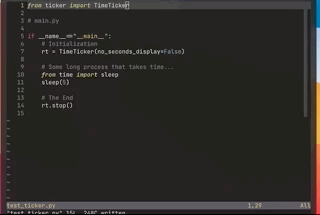

# Simple python tic that can ease your mind

We've all been there...staring at the empty terminal while your fans go crazy.  
I hope this relieves the intensity while you are waiting for that return statement.


<!--  -->

## How To

0. Install `tictronome` from `pip`

```{shell}
$ pip install tictronome
```

1. Import `Tic` object from `tictronome`.

```{python}
from tictronome.tictronome import Tic
```

2. Initialize it before some time-consuming process.

```{python}
tic = Tic()
some_long_function(...)
```

3. Call the `stop` method of `Tic` to stop.

```{python}
# end of your script
tic.stop()
```

4. Run your script!

```{shell}
$ python3 your_script.py
```
