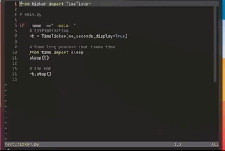

# Simple python ticker that can ease your mind

We've all been there...staring at the empty terminal while your fans go crazy.  
I hope this relieves the intensity waiting for that return statement.

## How To

1. Import `TimeTicker` object.
2. Initialize it before some time-consuming process.
3. Call the `stop` method of the object to stop.